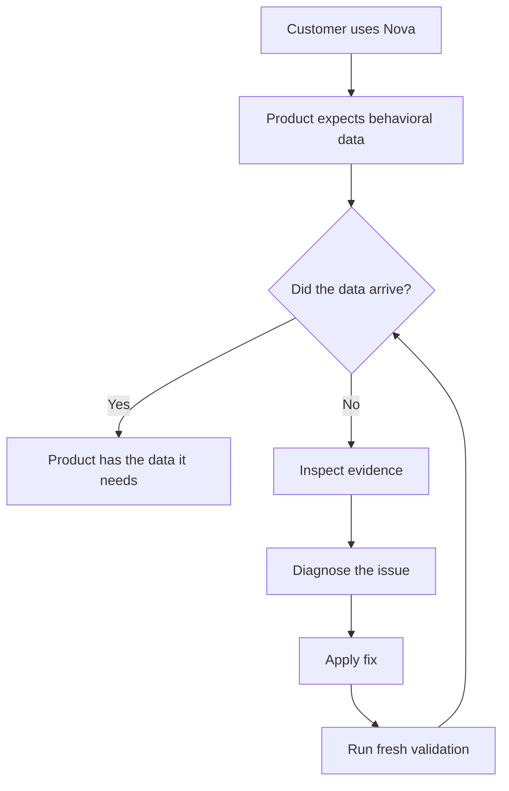

# SignalTrace

A product exercise exploring the gap between technical capability,
implementation, and customer value.

**[Try the live walkthrough →](https://nivoonna.github.io/signaltrace/)**

## The problem

Nova is a fictional shopping app. Its Product team wants reliable data
about what customers view and add to cart, so it can understand their
shopping behavior and make informed decisions.

The app can appear to work normally while analytics silently fails.
Customers can still shop, but Product loses the data it needs.

## The experience

Step into the role of Nova’s PM:

1. **Use Nova** — view a product and add it to your cart.
2. **See what Product receives** — compare customer actions with analytics.
3. **Inspect what happened** — follow the evidence behind the outcome.

Choose **Data flowing** to see successful delivery, or **Data missing**
to experience the same app with a hidden implementation problem.

The broken journey continues through diagnosis, a user-applied fix, and
fresh validation. Original failed actions remain visible alongside the
new results.

**Applying a fix is not success. Customer value is restored only when
fresh data is verified again.**

## How SignalTrace works

## What this project demonstrates

SignalTrace shows how I approach a technical product problem end to end:
start with the customer outcome, understand implementation friction,
make system behavior visible, and use evidence to guide decisions.
Diagnosis and remediation lead to a measurable check that value has
been restored.

## What's real

**Local full-stack implementation:** Next.js → FastAPI → SQLite.
It uses real HTTP requests, event validation, persistence, retrieval,
diagnostic functions, and automated tests. Nova and its analytics
integration are simulated; the current diagnosis follows explicit
evidence rules.

**Public GitHub Pages demo:** the same walkthrough runs as a deterministic
browser simulation, with no setup required. Delivery and storage evidence
are labeled as simulated. FastAPI and SQLite do not run on GitHub Pages.

## Current scope

**Built:** A guided walkthrough with Data flowing and Data missing
scenarios, analytics ingestion and retrieval, technical evidence,
and diagnosis → fix → fresh validation. Automated tests cover both
modes, and the public demo is live.

**Next:** A model-driven diagnostic agent using explicit tools,
agent evaluations, additional failure scenarios, and a native Swift
reference implementation.

## Go deeper

- [Product brief](docs/product-brief.md) — problem, outcomes, and success measures.
- [Architecture](docs/architecture.md) — system boundaries and technical design.
- [Product decisions](docs/product-decisions.md) — choices and tradeoffs.
- [Build plan](docs/build-plan.md) — delivery sequence and planned work.
- [Implementation guide](docs/implementation-guide.md) — local setup, API, tests, and deployment.
