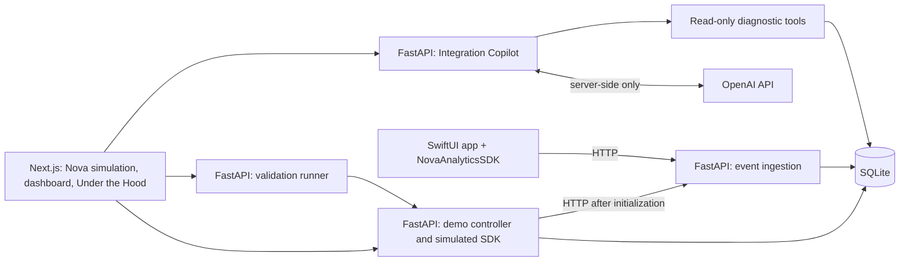

# SignalTrace

**SignalTrace shows what happens between a user tapping a button in a mobile app and that action appearing as analytics data, and what happens when something in that chain breaks.**

Analytics data records how people use an app, such as which products they view or add to their cart. Explore that journey through Nova, a fictional shopping app represented by a browser simulation. Nova's Product team wants reliable data to understand its customers' shopping journey.

**Current status: a full-stack local MVP and a static public-demo build.** Choose **Data flowing** or **Data missing**, use Nova, review what Product receives, then inspect the delivery evidence. Each step has its own page. Data missing supports diagnosis from evidence, a user-applied initialization fix, and fresh validation in the same session. AI diagnosis and native iOS remain planned.

The exercise demonstrates a simple product problem: a technical capability creates value only when it is implemented correctly and the customer can trust that it works.

## Happy Flow — See how it works

Start with everything working. Tap “Add to cart” and follow an **event**, a record of that action, through the system:

**Mobile app → SDK → API → backend → analytics dashboard**

1. **Mobile app:** Nova is the shopping interface where you view a product and tap “Add to cart.”
2. **SDK (software development kit):** The analytics code added to the app records your action as an event and sends it onward.
3. **API (application programming interface):** A defined entry point receives the event sent by the SDK.
4. **Backend:** The software running on a server checks the event and stores it.
5. **Analytics dashboard:** A screen displays the recorded action so you can see that it arrived.

## Diagnostic Flow — Find what broke

Explore the same system with one layer intentionally broken. The shopping app keeps working, so you can still view products and add them to your cart, but those actions are missing from the analytics dashboard.

The MVP lets you inspect delivery evidence yourself. In the planned full Diagnostic Flow, you will also be able to ask the **Integration Copilot**, an AI assistant that uses tools to read what the system reports. The investigation will examine:

- **SDK state:** Whether the analytics code has been started and is ready to record actions.
- **Logs:** Records of what the system did and any errors it encountered.
- **API behavior:** Whether the SDK sent a request and what response it received.
- **Event delivery:** Whether each recorded action reached the backend and appeared on the dashboard.

The MVP's first failure is analytics code that was never started, or **initialized**. The app still works, but no analytics delivery request is made. On `/evidence`, request a diagnosis, apply the fix, then validate fresh actions. The original failed attempts remain visible. Switching scenarios still starts a separate session; it does not repair the original incident.

## Why this exercise exists

The goal is to show how I approach a technical product problem end to end: understanding the user workflow, designing the system, working across SDKs and APIs, using AI for diagnosis, and validating that the solution actually works.

## Product hypothesis

When analytics data is missing, finding where the chain broke can take longer than fixing it. An AI assistant that examines the system's evidence may help people find the cause faster.

That is a hypothesis to test, not a measured result. SignalTrace will compare investigation with and without the Copilot, then check whether the proposed fix actually restores event delivery.

## What exists and what is planned

The labels describe different dimensions: **implemented** means present and verified; **planned** means not built; **simulated** means an intentional model of another system; **mocked** means a fixed test substitute. A future component can be implemented while still representing a simulation.

| Component | Status today | Intended behavior |
| --- | --- | --- |
| Product brief, architecture, decisions, build plan | Present; ready for review | Documentation of the proposed product |
| Nova commerce experience | Implemented simulation | Browser shopping app with one product and a working cart |
| Browser analytics model | Implemented simulation | Browser-owned initialization state and expected events; healthy and uninitialized modes |
| Event ingestion API and stored events | Implemented | `POST /events` validates and persists events in SQLite |
| Automated ingestion tests | Implemented | Accepted events, invalid input, duplicate protection, and persistence after restart |
| Session retrieval and Nova Analytics | Implemented | `GET /sessions/{session_id}/events` reads SQLite; dashboard compares expected and received events |
| Technical evidence | Implemented | Browser tracking attempts, actual HTTP results, and stored status; durable diagnostic logs remain planned |
| Diagnosis and recovery | Implemented for missing initialization | Read-only backend tools, deterministic diagnosis, explicit user fix, and fresh events verified in SQLite |
| Integration Copilot | Planned | Live server-side OpenAI calls and explicit diagnostic functions |
| Provider responses in deterministic tests | Planned; intended mocks | Clearly labeled fixed responses; never presented as live AI |
| SwiftUI app and `NovaAnalyticsSDK` | Planned | Native reference app and original Swift package |
| Static public demo and Pages workflow | Implemented; publication requires repository setup and a push | Same walkthrough with clearly labeled browser-only delivery, diagnosis, and storage |
| Broader tests and agent evaluations | Planned | Full-flow verification exists; no agent evaluation results yet |

Nova is fictional. Product names, scenarios, data, assets, and implementation will be original. No employer code, internal documentation, screenshots, architecture, or data are used. Any simulated business metrics must be labeled **demo data**.

## Live demo

[Public GitHub Pages walkthrough](https://nivoonna.github.io/signaltrace/) — available after the first successful Pages deployment. This change prepares the site and workflow; it does not publish it automatically from your working tree.

The hosted walkthrough uses **browser simulation**. It runs without FastAPI, SQLite, API keys, or external services. Choose **Data flowing** or **Data missing**, then follow `/signaltrace/` → `/signaltrace/play/` → `/signaltrace/results/` → `/signaltrace/evidence/`. Data missing includes **Diagnose the issue → Apply fix → Run validation → Implementation restored**.

Both versions share the shopping, tracking, recovery, and navigation controls. Only the public build injects `lib/static-demo.ts` through the existing transport interface. It keeps session-scoped event rows and observations in browser memory; derives diagnosis from initialization, attempts, logs, and those rows; and verifies two fresh validation events against that simulated store. It does not replay the failed events or declare recovery just because a fix was applied. IDs and timestamps are deterministic demo values. This delivery model is not a replacement for FastAPI contract validation or durable SQLite storage.

A visible public-demo notice appears on every route. Technical evidence explicitly labels simulated API requests, HTTP responses, diagnostic tools, and storage. Navigation and Back/Forward retain the current walkthrough. A full refresh clears browser memory and offers **Choose a scenario**, with no invented results.

### Build and preview the static demo

With Node.js 24+ and pnpm 11.19.0, from `apps/web`:

```powershell
pnpm install --frozen-lockfile
pnpm build:static
pnpm preview:static
```

Open [the local static preview](http://127.0.0.1:4173/signaltrace/). No API process is required. `build:static` sets `SIGNALTRACE_STATIC_DEMO=1` only for its child build. Next.js exports `out/index.html`, `out/play/index.html`, `out/results/index.html`, and `out/evidence/index.html`, with a `/signaltrace` base path, trailing slashes, and `.nojekyll`. The preview serves directory indexes just as Pages does; it has no API or fallback to a Next server.

After building, stop the preview before running `pnpm test:static`: Playwright starts its own static server on port 4173. To use installed Chrome on Windows, set `$env:PLAYWRIGHT_CHANNEL = 'chrome'`. Otherwise install Chromium using `pnpm exec playwright install chromium`.

### Publish to GitHub Pages

1. In `nivoonna/signaltrace`, open **Settings → Pages → Build and deployment → Source**, and select **GitHub Actions**. Do not select “Deploy from a branch.”
2. In **Settings → Environments → github-pages**, allow **deploy/github-pages** under deployment branches if a branch restriction exists. If the environment does not yet exist, create it with that name and allow the branch.
3. After reviewing the changes, commit them on `deploy/github-pages` and push with `git push -u origin deploy/github-pages`. Include the existing uncommitted recovery implementation, which this demo uses. No merge to `main` is needed.
4. Open **Actions → Deploy SignalTrace demo to GitHub Pages** and wait for both `build` and `deploy` to pass. If setup was completed after an initial failure, use **Re-run all jobs**. The first push triggers the workflow even if the workflow is absent from the default branch; the manual “Run workflow” button may require it on the default branch.
5. Open [https://nivoonna.github.io/signaltrace/](https://nivoonna.github.io/signaltrace/) and try both scenarios.

The workflow installs the pinned dependencies, runs state tests, builds the static export, checks all four HTML routes, and runs browser-only journey tests before uploading **only `apps/web/out`**. Deployment uses GitHub's built-in token and the `github-pages` environment; no API keys or backend hosting are required. Subsequent pushes to `deploy/github-pages` redeploy. See [GitHub's custom Pages workflow instructions](https://docs.github.com/en/pages/getting-started-with-github-pages/using-custom-workflows-with-github-pages).

## Full-stack implementation

The repository retains the real **Next.js + FastAPI + SQLite** implementation. Normal `pnpm dev` and `pnpm build` use real HTTP delivery and session retrieval through the existing web proxy. Leave `SIGNALTRACE_STATIC_DEMO` unset for local full-stack commands. The static build does not change your shell's mode; rebuild with `pnpm build` before `pnpm start` if you last built the static export (both builds use `.next`).

### Run the visible MVP

Start the API using the instructions below. In a second terminal, with Node.js 24+ and pnpm 11.19.0 installed:

```powershell
cd apps/web
pnpm install --frozen-lockfile
pnpm dev
```

If needed, install the pinned package manager with `npm install --global pnpm@11.19.0` first. Open [SignalTrace at localhost:3000](http://127.0.0.1:3000).

1. On `/`, choose **Data flowing** or **Data missing**, then **Start walkthrough**. The landing page does not generate events.
2. On `/play`, opening the product creates one view action. Press **Add to cart**, then **See what Product receives**. Only the customer simulation appears on this page.
3. On `/results`, review **Customer actions: 2** and **Reached analytics: 2 of 2** for Data flowing, or **0 of 2** for Data missing. The phone and raw evidence are absent. Choose **Inspect what happened**.
4. On `/evidence`, inspect event IDs, the session, analytics state, actual HTTP results, and storage verification. In Data missing, **Diagnose the issue** reveals the finding and **View technical evidence** preserves the raw fields. **Try other scenario** starts a fresh session on `/play`; **Start over** returns to `/`.

The buttons use Next.js client navigation and change the browser URL. A React context in the shared root layout retains the selected scenario, session, cart, expected events, and delivery evidence across routes, including Back/Forward navigation. This state is deliberately held in memory: SQLite cannot reconstruct actions that were never delivered. Refreshing a step or opening it directly without a walkthrough shows a SignalTrace introduction, a preview of the three steps, and a **Choose a scenario** action instead of invented results. Accepted events remain in SQLite.

More cart clicks create more expected events. Storage is read after each action and polled three seconds after each completed background read, including while viewing evidence. Backend failures show delivery as **unconfirmed**, not as a successful or empty read.

The web server forwards `/api/events` to FastAPI's `/events` and `/api/sessions/{session_id}/events` to the matching read endpoint. Set `SIGNALTRACE_API_URL` before starting/building Next.js to change its default `http://127.0.0.1:8000` destination. No CORS configuration or browser secrets are required. To run the optimized build, use `pnpm build` then `pnpm start` instead of `pnpm dev`.

**Real:** HTTP ingestion, contract validation, duplicate protection, SQLite persistence, session retrieval, diagnostic function execution, and storage-verified recovery. **Simulated:** Nova, its product/cart, browser analytics initialization, and the intentional missing-initialization incident. The mug illustration is original SVG artwork. Cart contents and tracking evidence originate in browser memory; accepted events survive restarts in SQLite. There is no checkout, production SDK, or AI integration.

The full-stack API is for local use: session IDs filter data but do not authorize access. Authentication, retention/cleanup, pagination, public backend deployment, and durable tracking-attempt storage are deferred. The public Pages demo has its own browser-only mode described above.

### Review diagnosis and recovery

Open `/` → **Data missing** → **Start walkthrough** → **Add to cart** → **See what Product receives** → **Inspect what happened** → **Diagnose the issue** → **Apply fix** → **Run validation**.

The backend exposes `get_sdk_state(session_id)`, `get_event_delivery(session_id)`, and `get_runtime_logs(session_id)` in `apps/api/diagnostics.py`. Diagnosis requires observed actions and expectations, uninitialized analytics, no delivery attempts, zero stored session events, and corresponding action/drop runtime records. Missing or contradictory evidence cannot produce that finding; storage failure is unconfirmed. The finding is a deterministic rule, not an AI response.

The browser uploads its actual simulation observations with `PUT /diagnostics/sessions/{session_id}/evidence`. This telemetry intake does not initialize analytics or insert events. The read-only GET endpoints under the same prefix are `/sdk-state`, `/event-delivery`, `/runtime-logs`, and `/diagnosis`. The investigation calls all three tools. SDK state/logs come from the browser observation; event delivery is checked independently against SQLite. The web proxy adds `/api` to these paths.

**Apply fix** changes the existing browser session's initialization state and reports that observation. It sends no analytics events and cannot mark recovery successful. **Run validation** performs a new view and cart action through the same tracking functions, with new IDs and timestamps. Those events pass through the unchanged `POST /events` endpoint. Recovery requires both fresh payloads to match the real session retrieval results by ID, session, event, product, and timestamp. HTTP acceptance alone is insufficient. Failed validation can be run again with new events; original attempts are never replayed. Before/after counts distinguish the original incident from the latest validation run.

Diagnostic observations are an ephemeral, application-local mirror of browser state, refreshed during diagnosis, fix, and validation. They are not independent production SDK telemetry or durable logs. A backend restart clears this mirror; the next user operation uploads it again. The existing page-refresh restart behavior is unchanged. This small local extension does not implement the broader backend-owned simulation, authorized sessions, or AI architecture described in the deeper planning documents.

### Run the event ingestion API

This first increment accepts one event at a time through `POST /events`. It uses real FastAPI validation and a real SQLite file; no application behavior is simulated or mocked here. Authentication and session ownership checks are deferred, so this increment is intended for local use. `session_id` is event metadata, not proof of identity.

With Python 3.12+ installed, run these commands from the repository root. PowerShell:

```powershell
python -m venv .venv
.\.venv\Scripts\python.exe -m pip install -r requirements-dev.txt
.\.venv\Scripts\python.exe -m uvicorn apps.api.main:app --host 127.0.0.1 --port 8000
```

On macOS/Linux, use `python3 -m venv .venv` and `.venv/bin/python` in place of `.\.venv\Scripts\python.exe` for the remaining commands. Runtime-only installation can use `requirements.txt` instead.

The database is created at `data/signaltrace.sqlite3` when the app starts. Set `SIGNALTRACE_DB_PATH` before startup to use another SQLite file; relative paths are resolved from the working directory. The database and virtual environment are ignored by Git. Interactive API documentation is available at [localhost:8000/docs](http://127.0.0.1:8000/docs) while the server runs.

### Event contract

All five fields are required. Both supported events describe a product, so both require `product_id`.

| Field | Rule |
| --- | --- |
| `event_id` | Globally unique, case-sensitive string; 1–128 characters with no whitespace |
| `event` | Exactly `product_viewed` or `product_added_to_cart` |
| `session_id` | Case-sensitive string; 1–128 characters with no whitespace |
| `timestamp` | ISO 8601 string: `YYYY-MM-DDTHH:MM:SS[.ffffff]Z` or an explicit `+/-HH:MM` timezone offset; normalized to UTC for storage |
| `product_id` | Case-sensitive string; 1–128 characters with no whitespace |

Extra fields, missing fields, invalid types, invalid dates, timestamps without a timezone, and numeric timestamps are rejected. This increment has no product catalog: `product_id` identifies a product but is not checked against a catalog.

Send an event from a second PowerShell terminal:

```powershell
$event = @{
    event_id = 'evt-001'
    event = 'product_viewed'
    session_id = 'session-001'
    timestamp = '2026-09-28T12:34:56Z'
    product_id = 'nova-mug'
} | ConvertTo-Json

Invoke-RestMethod -Method Post -Uri 'http://127.0.0.1:8000/events' -ContentType 'application/json' -Body $event
```

The first submission returns `201 Created` with:

```json
{"event_id": "evt-001", "status": "accepted"}
```

| Request outcome | HTTP response | Storage behavior |
| --- | --- | --- |
| Valid new event | `201 Created` with event ID and `accepted` status | Returned only after SQLite commits the row |
| Malformed JSON or invalid event fields | `422 Unprocessable Entity` with a `detail` list of validation errors | Nothing stored |
| Unsupported event type | `422 Unprocessable Entity` with an error for `event` | Nothing stored |
| Duplicate `event_id`, even with a different session or payload | `409 Conflict` with `detail.code=duplicate_event_id` | Original record unchanged |
| SQLite operational failure | `503 Service Unavailable` with `detail.code=storage_unavailable` | No acceptance reported |

Repeating the example produces a duplicate response. Use a new `event_id` for a new action. The existing ingestion contract is unchanged by the visible MVP.

### Read a session's events

`GET /sessions/{session_id}/events` returns `200` with an array of the session's committed events in insertion order, including all five contract fields. An unknown session returns `[]`. Invalid session identifiers return `422`; unavailable storage returns `503` with `detail.code=storage_unavailable`. Responses use `Cache-Control: no-store`. Session filtering is case-sensitive and parameterized; it is not authentication.

```powershell
Invoke-RestMethod 'http://127.0.0.1:8000/sessions/session-001/events'
```

### Run the tests

```powershell
.\.venv\Scripts\python.exe -m pytest -q -W error
```

The 40 backend cases use fixed inputs and separate temporary SQLite files, leaving the local demo database untouched. They retain all 33 ingestion/retrieval cases and add seven diagnostic cases covering tool evidence, read-only behavior, contradictory evidence, session isolation, and unavailable storage. A live Uvicorn test verifies ingestion, retrieval, and duplicates over actual HTTP.

From `apps/web`:

```powershell
pnpm test
pnpm typecheck
pnpm build
```

The original 19 browser-state cases use fixed IDs/clocks and explicitly mocked transport. They verify both scenarios, exact event payloads, storage-backed health, mismatched records, errors/recovery, repeated actions, stale responses, initialization without false recovery, and fresh validation. Nine additional static-demo cases verify deterministic delivery, the complete recovery progression, contradictory diagnostic evidence, independent walkthrough stores, and duplicate protection: **28 state tests total**. They do not substitute for running the two applications together.

With both applications running, twelve Playwright browser tests check both complete route journeys, URL changes and step isolation, actual delivery/retrieval, no delivery in issue mode, Back/Forward navigation, session resets, direct visits and refreshes, delivery completing after navigation, an explicitly mocked read outage and recovery, a narrow screen, keyboard controls, the complete diagnostic/recovery journey, and withholding recovery until fresh storage is verified. They add new UUID sessions to the local demo database without changing existing records. Screenshots and session evidence are written to ignored `apps/web/test-results/` files.

```powershell
# Use an installed Chrome browser (PowerShell):
$env:PLAYWRIGHT_CHANNEL = 'chrome'
pnpm test:e2e
```

Alternatively, run `pnpm exec playwright install chromium` and leave `PLAYWRIGHT_CHANNEL` unset. `PLAYWRIGHT_BASE_URL` defaults to `http://127.0.0.1:3000`.

Separately, `pnpm build:static` then `pnpm test:static` run five static browser cases. They verify both scenario journeys, complete diagnosis/fix/fresh validation, original failed evidence, base-path assets, direct visits, refresh guards, and all four URLs while rejecting API and external-service requests. Static tests are separate from the twelve full-stack browser tests; neither suite replaces the other.

## First incident: SDK not initialized

The first planned vertical slice is `sdk_not_initialized`:

1. Open the simulated Nova app in a new demo session.
2. View a product, then add it to the cart.
3. Expect `product_viewed` and `product_added_to_cart` events.
4. Observe two dropped tracking attempts because the SDK was never initialized.
5. See two expected events and zero ingested events in the dashboard.
6. Ask the Integration Copilot why events are missing.
7. Inspect its explicit `get_sdk_state` call and returned evidence.
8. Read a diagnosis tied to that evidence: initialization is missing.
9. Apply the demo initialization fix through a user-controlled action.
10. Rerun the two commerce actions as a new validation run.
11. Observe successful HTTP ingestion and the two stored events.
12. See validation pass while the original failed attempts remain visible.

Before initialization, **no ingestion request occurs**. The dashboard must distinguish a dropped SDK call from an HTTP rejection. The fix does not retroactively recover dropped events; validation generates fresh events.

## High-level architecture — planned

The diagram describes the future diagnostic system. In the current MVP, the browser owns the analytics simulation and posts directly through the web proxy to ingestion. The backend controller, Copilot, and validation runner below are not implemented; [D13](docs/product-decisions.md#d13--deliver-the-visible-mvp-with-a-browser-analytics-model) records this scope choice.



The browser does not run Swift. Its modeled SDK behavior and the native package will share event contracts and parity fixtures. FastAPI owns domain behavior; Next.js owns presentation. SQLite supports the initial small deployment. See [architecture](docs/architecture.md) for boundaries, API contracts, state, and tradeoffs.

## Incident coverage

**Missing initialization is runnable in the browser MVP.** It demonstrates missing delivery, read-only diagnosis, user-controlled remediation, and fresh recovery validation within the same session. Additional incidents remain planned.

| Incident | Intended failing layer | Scope |
| --- | --- | --- |
| SDK not initialized | SDK lifecycle | Browser simulation, same-session remediation, and fresh validation implemented |
| Missing tracking call | Application instrumentation | Backlog candidate |
| Invalid ingestion credential | Authentication | Backlog candidate |
| Consent prevents collection | Privacy configuration | Backlog candidate; respect consent, do not bypass it |
| Invalid event payload | Event schema | Backlog candidate |
| Network unavailable or ingestion unavailable | Delivery / backend | Backlog candidates; distinguish no response from an HTTP error |

## Agent integration — planned

The first three read-only functions below now support deterministic diagnosis in the local MVP. This table describes their broader planned agent interface and the additional validation-result tool. No model integration is implemented.

| Tool | Evidence returned |
| --- | --- |
| `get_sdk_state` | Initialization state, source, observation time, version, and dropped-attempt summary |
| `get_runtime_logs` | Bounded, redacted logs correlated with actions and tracking attempts |
| `get_event_delivery` | Expected events, attempted requests, actual HTTP outcomes, and stored events for a run |
| `get_validation_result` | Checks and evidence from a completed validation run |

In the planned agent integration, the backend will scope authorized tool access to the active session. The agent will diagnose and recommend; the user will apply the fix and start validation. No model tool will change configuration. Planned tool definitions and error behavior are in [architecture](docs/architecture.md).

## Validation and evaluation

Deterministic tests verify the event contract, HTTP responses, SQLite persistence, duplicate protection, diagnostic evidence, simulated initialization, and fresh recovery validation. Browser tests exercise the complete missing-data-to-recovery path against the local API. A validation pass requires both fresh expected events in storage. Authorized session isolation, native SDK parity, and agent evaluations remain planned.

Agent evaluations will separately assess tool use, correct root cause, evidence grounding, uncertainty, and appropriate remediation. Offline tests will mock the model provider; separately labeled live evaluations will exercise the real OpenAI integration. Report versions, sample sizes, failures, latency, and cost alongside results. There are no measured results yet.

Product assessment will compare diagnosis and validated recovery with and without the Copilot using equivalent evidence. The [product brief](docs/product-brief.md) defines metrics; the [build plan](docs/build-plan.md) defines release gates.

## Repository structure

Present now:

```text
signaltrace/
|-- README.md
|-- .gitignore
|-- requirements.txt
|-- requirements-dev.txt
|-- apps/api/
|   |-- __init__.py
|   |-- main.py
|   |-- models.py
|   `-- database.py
|-- tests/
|   `-- test_events.py
`-- docs/
    |-- product-brief.md
    |-- architecture.md
    |-- product-decisions.md
    `-- build-plan.md
```

The web app now lives in `apps/web/` (Next.js/React, browser analytics model, and state tests). Remaining proposed directories:

```text
apps/ios/                    Nova SwiftUI reference app
packages/NovaAnalyticsSDK/    Original Swift package and package tests
contracts/                   Versioned event and diagnostic schemas; shared fixtures
evals/                       Agent cases, rubrics, runner, and labeled reports
```

## Explore further

- [Product brief](docs/product-brief.md): the problem, planned experience, and how success will be measured.
- [Architecture](docs/architecture.md): how the parts connect, exchange data, and verify delivery.
- [Product decisions](docs/product-decisions.md): the choices behind the design and their tradeoffs.
- [Build plan](docs/build-plan.md): milestones, tests, and evaluation of the Copilot's diagnoses.

The visible MVP demonstrates healthy delivery, missing analytics, and verified recovery through the same shopping interface. The public static export and its deployment workflow live on `deploy/github-pages`; the full-stack backend remains local. The broader Diagnostic Flow, Integration Copilot, native app, and public backend deployment remain separate, reviewable increments.
