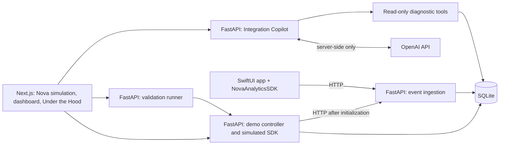

# SignalTrace

SignalTrace is an end-to-end technical product exercise in SDK integration, APIs, AI-assisted debugging, and validation. It models a mobile team whose analytics SDK is integrated into an iOS app, but whose expected events never reach the product.

The central question is **which layer failed, what evidence proves it, and how do we verify the fix?** The planned experience follows that question from a fictional commerce app through SDK state, HTTP delivery, backend ingestion, and an AI Integration Copilot with visible tool calls.

**Current status: documentation and architecture only.** This repository contains the five documents listed below. No application, SDK, API, agent, automated tests, evaluation results, CI workflow, or live deployment has been implemented.

## Product hypothesis

When an SDK integration fails, developers often spend more time identifying the responsible layer than applying the eventual fix. An agent that inspects configuration, runtime logs, API behavior, and event state through explicit diagnostic tools may reduce the search space and shorten time to root cause.

This is a hypothesis to validate, not a measured outcome. The exercise connects product framing, implementation, debugging, tests, agent evaluations, and a GitHub development workflow into one inspectable product story.

## What exists and what is planned

The labels describe different dimensions: **implemented** means present and verified; **planned** means not built; **simulated** means an intentional model of another system; **mocked** means a fixed test substitute. A future component can be implemented while still representing a simulation.

| Component | Status today | Intended behavior |
| --- | --- | --- |
| Product brief, architecture, decisions, build plan | Present; ready for review | Documentation of the proposed product |
| Nova commerce experience | Planned; intended simulation | Browser representation of a simple iOS shopping app |
| Browser-path SDK model | Planned; intended simulation | Backend-owned SDK state with reproducible incident behavior |
| Event API, stored events, logs, dashboard | Planned | Actual HTTP requests, persisted evidence, and observed delivery status |
| Integration Copilot | Planned | Live server-side OpenAI calls and explicit diagnostic functions |
| Provider responses in deterministic tests | Planned; intended mocks | Clearly labeled fixed responses; never presented as live AI |
| SwiftUI app and `NovaAnalyticsSDK` | Planned | Native reference app and original Swift package |
| Tests, evaluations, GitHub Actions, hosted demo | Planned | Verification and delivery evidence; no results yet |

Nova is fictional. Product names, scenarios, data, assets, and implementation will be original. No employer code, internal documentation, screenshots, architecture, or data are used. Any simulated business metrics must be labeled **demo data**.

## First incident: SDK not initialized

The first planned vertical slice is `sdk_not_initialized`:

1. Open the simulated Nova app in a new demo session.
2. View a product, then add it to the cart.
3. Expect `product_viewed` and `product_added_to_cart` events.
4. Observe two dropped tracking attempts because the SDK was never initialized.
5. See two expected events and zero ingested events in the dashboard.
6. Ask the Integration Copilot why events are missing.
7. Inspect its explicit `get_sdk_state` call and returned evidence.
8. Read a diagnosis tied to that evidence: initialization is missing.
9. Apply the demo initialization fix through a user-controlled action.
10. Rerun the two commerce actions as a new validation run.
11. Observe successful HTTP ingestion and the two stored events.
12. See validation pass while the original failed attempts remain visible.

Before initialization, **no ingestion request occurs**. The dashboard must distinguish a dropped SDK call from an HTTP rejection. The fix does not retroactively recover dropped events; validation generates fresh events.

## High-level architecture — planned



The browser does not run Swift. Its modeled SDK behavior and the native package will share event contracts and parity fixtures. FastAPI owns domain behavior; Next.js owns presentation. SQLite supports the initial small deployment. See [architecture](docs/architecture.md) for boundaries, API contracts, state, and tradeoffs.

## Incident coverage

**No incident is runnable today.** The supported set will expand only when each scenario has evidence, remediation, and validation.

| Incident | Intended failing layer | Scope |
| --- | --- | --- |
| SDK not initialized | SDK lifecycle | First planned vertical slice |
| Missing tracking call | Application instrumentation | Backlog candidate |
| Invalid ingestion credential | Authentication | Backlog candidate |
| Consent prevents collection | Privacy configuration | Backlog candidate; respect consent, do not bypass it |
| Invalid event payload | Event schema | Backlog candidate |
| Network unavailable or ingestion unavailable | Delivery / backend | Backlog candidates; distinguish no response from an HTTP error |

## Agent tools — proposed, not implemented

| Tool | Evidence returned |
| --- | --- |
| `get_sdk_state` | Initialization state, source, observation time, version, and dropped-attempt summary |
| `get_runtime_logs` | Bounded, redacted logs correlated with actions and tracking attempts |
| `get_event_delivery` | Expected events, attempted requests, actual HTTP outcomes, and stored events for a run |
| `get_validation_result` | Checks and evidence from a completed validation run |

Tool access is scoped to the active session by the backend. The agent diagnoses and recommends; the user applies the fix and starts validation. No model tool changes configuration. Planned tool definitions and error behavior are in [architecture](docs/architecture.md).

## Validation and evaluation

Deterministic tests will verify SDK transitions, schemas, HTTP responses, persistence, session isolation, and the complete failure-to-recovery flow. A validation pass requires fresh evidence from the current run, including both expected events in storage; a green chat message is insufficient.

Agent evaluations will separately assess tool use, correct root cause, evidence grounding, uncertainty, and appropriate remediation. Offline tests will mock the model provider; separately labeled live evaluations will exercise the real OpenAI integration. Report versions, sample sizes, failures, latency, and cost alongside results. There are no measured results yet.

Product assessment will compare diagnosis and validated recovery with and without the Copilot using equivalent evidence. The [product brief](docs/product-brief.md) defines metrics; the [build plan](docs/build-plan.md) defines release gates.

## Repository structure

Present now:

```text
signaltrace/
|-- README.md
`-- docs/
    |-- product-brief.md
    |-- architecture.md
    |-- product-decisions.md
    `-- build-plan.md
```

Proposed implementation directories — none exists yet:

```text
apps/web/                    Next.js interface
apps/api/                    FastAPI, simulation, ingestion, tools, validation
apps/ios/                    Nova SwiftUI reference app
packages/NovaAnalyticsSDK/    Original Swift package and package tests
contracts/                   Versioned event and diagnostic schemas; shared fixtures
tests/                       Cross-component contract, integration, and browser tests
evals/                       Agent cases, rubrics, runner, and labeled reports
.github/workflows/           CI workflows
```

## Review paths

| Reader | Start here |
| --- | --- |
| Recruiter | Opening summary, current status, and first incident above |
| Hiring manager | [Product brief](docs/product-brief.md): problem, hypothesis, scope, metrics |
| Technical PM / engineer | [Architecture](docs/architecture.md) and [product decisions](docs/product-decisions.md) |
| Engineer | [Build plan](docs/build-plan.md): milestones, tests, evaluations, GitHub workflow |

There are no setup commands yet because there is no runnable application. The next proposed milestone is the deterministic incident engine and ingestion contract. Implementation starts in a subsequent task after this documentation review.
