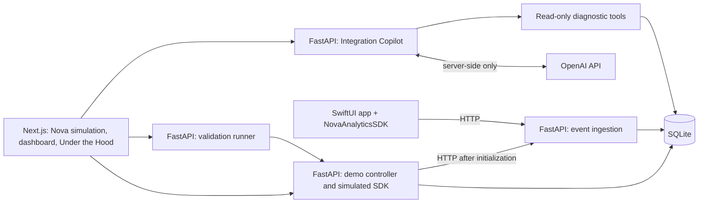

# SignalTrace

**SignalTrace shows what happens between a user tapping a button in a mobile app and that action appearing as analytics data, and what happens when something in that chain breaks.**

Analytics data records how people use an app, such as which products they view or add to their cart. The planned experience lets you explore that journey through Nova, a fictional shopping app represented by a browser simulation.

**Current status: the event ingestion API is implemented.** You can send an event over HTTP, have it checked and stored in SQLite, and verify the behavior with automated tests. The two full experiences below remain planned; there is no shopping interface, dashboard, or Integration Copilot yet.

## Happy Flow — See how it works

Start with everything working. Tap “Add to cart” and follow an **event**, a record of that action, through the system:

**Mobile app → SDK → API → backend → analytics dashboard**

1. **Mobile app:** Nova is the shopping interface where you view a product and tap “Add to cart.”
2. **SDK (software development kit):** The analytics code added to the app records your action as an event and sends it onward.
3. **API (application programming interface):** A defined entry point receives the event sent by the SDK.
4. **Backend:** The software running on a server checks the event and stores it.
5. **Analytics dashboard:** A screen displays the recorded action so you can see that it arrived.

## Diagnostic Flow — Find what broke

Explore the same system with one layer intentionally broken. The shopping app keeps working, so you can still view products and add them to your cart, but those actions are missing from the analytics dashboard.

Inspect the evidence yourself or ask the **Integration Copilot**, an AI assistant that uses tools to read what the system reports. The investigation can examine:

- **SDK state:** Whether the analytics code has been started and is ready to record actions.
- **Logs:** Records of what the system did and any errors it encountered.
- **API behavior:** Whether the SDK sent a request and what response it received.
- **Event delivery:** Whether each recorded action reached the backend and appeared on the dashboard.

The first planned failure is an SDK that was never started, or **initialized**. After finding the root cause, you apply the fix and repeat the actions. You then **validate** the fix by checking that fresh events reach the dashboard; the earlier failed attempts remain visible.

## Why this exercise exists

The goal is to show how I approach a technical product problem end to end: understanding the user workflow, designing the system, working across SDKs and APIs, using AI for diagnosis, and validating that the solution actually works.

## Product hypothesis

When analytics data is missing, finding where the chain broke can take longer than fixing it. An AI assistant that examines the system's evidence may help people find the cause faster.

That is a hypothesis to test, not a measured result. SignalTrace will compare investigation with and without the Copilot, then check whether the proposed fix actually restores event delivery.

## What exists and what is planned

The labels describe different dimensions: **implemented** means present and verified; **planned** means not built; **simulated** means an intentional model of another system; **mocked** means a fixed test substitute. A future component can be implemented while still representing a simulation.

| Component | Status today | Intended behavior |
| --- | --- | --- |
| Product brief, architecture, decisions, build plan | Present; ready for review | Documentation of the proposed product |
| Nova commerce experience | Planned; intended simulation | Browser representation of a simple iOS shopping app |
| Browser-path SDK model | Planned; intended simulation | Backend-owned SDK state with reproducible incident behavior |
| Event ingestion API and stored events | Implemented | `POST /events` validates and persists events in SQLite |
| Automated ingestion tests | Implemented | Accepted events, invalid input, duplicate protection, and persistence after restart |
| Runtime evidence logs and dashboard | Planned | Inspect SDK behavior and observed delivery status |
| Integration Copilot | Planned | Live server-side OpenAI calls and explicit diagnostic functions |
| Provider responses in deterministic tests | Planned; intended mocks | Clearly labeled fixed responses; never presented as live AI |
| SwiftUI app and `NovaAnalyticsSDK` | Planned | Native reference app and original Swift package |
| Broader tests, agent evaluations, GitHub Actions, hosted demo | Planned | Full-flow verification and delivery evidence; no agent evaluation results yet |

Nova is fictional. Product names, scenarios, data, assets, and implementation will be original. No employer code, internal documentation, screenshots, architecture, or data are used. Any simulated business metrics must be labeled **demo data**.

## Run the event ingestion API

This first increment accepts one event at a time through `POST /events`. It uses real FastAPI validation and a real SQLite file; no application behavior is simulated or mocked here. Authentication and session ownership checks are deferred, so this increment is intended for local use. `session_id` is event metadata, not proof of identity.

With Python 3.12+ installed, run these commands from the repository root. PowerShell:

```powershell
python -m venv .venv
.\.venv\Scripts\python.exe -m pip install -r requirements-dev.txt
.\.venv\Scripts\python.exe -m uvicorn apps.api.main:app --host 127.0.0.1 --port 8000
```

On macOS/Linux, use `python3 -m venv .venv` and `.venv/bin/python` in place of `.\.venv\Scripts\python.exe` for the remaining commands. Runtime-only installation can use `requirements.txt` instead.

The database is created at `data/signaltrace.sqlite3` when the app starts. Set `SIGNALTRACE_DB_PATH` before startup to use another SQLite file; relative paths are resolved from the working directory. The database and virtual environment are ignored by Git. Interactive API documentation is available at [localhost:8000/docs](http://127.0.0.1:8000/docs) while the server runs.

### Event contract

All five fields are required. Both supported events describe a product, so both require `product_id`.

| Field | Rule |
| --- | --- |
| `event_id` | Globally unique, case-sensitive string; 1–128 characters with no whitespace |
| `event` | Exactly `product_viewed` or `product_added_to_cart` |
| `session_id` | Case-sensitive string; 1–128 characters with no whitespace |
| `timestamp` | ISO 8601 string: `YYYY-MM-DDTHH:MM:SS[.ffffff]Z` or an explicit `+/-HH:MM` timezone offset; normalized to UTC for storage |
| `product_id` | Case-sensitive string; 1–128 characters with no whitespace |

Extra fields, missing fields, invalid types, invalid dates, timestamps without a timezone, and numeric timestamps are rejected. This increment has no product catalog: `product_id` identifies a product but is not checked against a catalog.

Send an event from a second PowerShell terminal:

```powershell
$event = @{
    event_id = 'evt-001'
    event = 'product_viewed'
    session_id = 'session-001'
    timestamp = '2026-09-28T12:34:56Z'
    product_id = 'nova-mug'
} | ConvertTo-Json

Invoke-RestMethod -Method Post -Uri 'http://127.0.0.1:8000/events' -ContentType 'application/json' -Body $event
```

The first submission returns `201 Created` with:

```json
{"event_id": "evt-001", "status": "accepted"}
```

| Request outcome | HTTP response | Storage behavior |
| --- | --- | --- |
| Valid new event | `201 Created` with event ID and `accepted` status | Returned only after SQLite commits the row |
| Malformed JSON or invalid event fields | `422 Unprocessable Entity` with a `detail` list of validation errors | Nothing stored |
| Unsupported event type | `422 Unprocessable Entity` with an error for `event` | Nothing stored |
| Duplicate `event_id`, even with a different session or payload | `409 Conflict` with `detail.code=duplicate_event_id` | Original record unchanged |
| SQLite operational failure | `503 Service Unavailable` with `detail.code=storage_unavailable` | No acceptance reported |

Repeating the example produces a duplicate response. Use a new `event_id` for a new action. There is no event-reading HTTP endpoint yet; automated tests inspect the database through an independent SQLite connection.

### Run the tests

```powershell
.\.venv\Scripts\python.exe -m pytest -q
```

The tests use fixed inputs and separate temporary SQLite files, leaving the local demo database untouched. They cover both supported events, identifier and timestamp boundaries, malformed/unsupported input, duplicate protection including concurrent requests, persistence after reopening the app, database configuration, and storage failure. Most requests exercise FastAPI in-process; one live Uvicorn test verifies acceptance and duplicate responses over real HTTP on an ephemeral localhost port, then stops the server.

## First incident: SDK not initialized

The first planned vertical slice is `sdk_not_initialized`:

1. Open the simulated Nova app in a new demo session.
2. View a product, then add it to the cart.
3. Expect `product_viewed` and `product_added_to_cart` events.
4. Observe two dropped tracking attempts because the SDK was never initialized.
5. See two expected events and zero ingested events in the dashboard.
6. Ask the Integration Copilot why events are missing.
7. Inspect its explicit `get_sdk_state` call and returned evidence.
8. Read a diagnosis tied to that evidence: initialization is missing.
9. Apply the demo initialization fix through a user-controlled action.
10. Rerun the two commerce actions as a new validation run.
11. Observe successful HTTP ingestion and the two stored events.
12. See validation pass while the original failed attempts remain visible.

Before initialization, **no ingestion request occurs**. The dashboard must distinguish a dropped SDK call from an HTTP rejection. The fix does not retroactively recover dropped events; validation generates fresh events.

## High-level architecture — planned



The browser does not run Swift. Its modeled SDK behavior and the native package will share event contracts and parity fixtures. FastAPI owns domain behavior; Next.js owns presentation. SQLite supports the initial small deployment. See [architecture](docs/architecture.md) for boundaries, API contracts, state, and tradeoffs.

## Incident coverage

**No incident is runnable today.** The supported set will expand only when each scenario has evidence, remediation, and validation.

| Incident | Intended failing layer | Scope |
| --- | --- | --- |
| SDK not initialized | SDK lifecycle | First planned vertical slice |
| Missing tracking call | Application instrumentation | Backlog candidate |
| Invalid ingestion credential | Authentication | Backlog candidate |
| Consent prevents collection | Privacy configuration | Backlog candidate; respect consent, do not bypass it |
| Invalid event payload | Event schema | Backlog candidate |
| Network unavailable or ingestion unavailable | Delivery / backend | Backlog candidates; distinguish no response from an HTTP error |

## Agent tools — proposed, not implemented

| Tool | Evidence returned |
| --- | --- |
| `get_sdk_state` | Initialization state, source, observation time, version, and dropped-attempt summary |
| `get_runtime_logs` | Bounded, redacted logs correlated with actions and tracking attempts |
| `get_event_delivery` | Expected events, attempted requests, actual HTTP outcomes, and stored events for a run |
| `get_validation_result` | Checks and evidence from a completed validation run |

Tool access is scoped to the active session by the backend. The agent diagnoses and recommends; the user applies the fix and starts validation. No model tool changes configuration. Planned tool definitions and error behavior are in [architecture](docs/architecture.md).

## Validation and evaluation

Deterministic ingestion tests now verify the event contract, HTTP responses, SQLite persistence, and duplicate protection. Tests for SDK transitions, authorized session isolation, and the complete failure-to-recovery flow remain planned. In that future flow, a validation pass will require fresh evidence from the current run, including both expected events in storage; a green chat message will be insufficient.

Agent evaluations will separately assess tool use, correct root cause, evidence grounding, uncertainty, and appropriate remediation. Offline tests will mock the model provider; separately labeled live evaluations will exercise the real OpenAI integration. Report versions, sample sizes, failures, latency, and cost alongside results. There are no measured results yet.

Product assessment will compare diagnosis and validated recovery with and without the Copilot using equivalent evidence. The [product brief](docs/product-brief.md) defines metrics; the [build plan](docs/build-plan.md) defines release gates.

## Repository structure

Present now:

```text
signaltrace/
|-- README.md
|-- .gitignore
|-- requirements.txt
|-- requirements-dev.txt
|-- apps/api/
|   |-- __init__.py
|   |-- main.py
|   |-- models.py
|   `-- database.py
|-- tests/
|   `-- test_events.py
`-- docs/
    |-- product-brief.md
    |-- architecture.md
    |-- product-decisions.md
    `-- build-plan.md
```

Proposed implementation directories — none exists yet:

```text
apps/web/                    Next.js interface
apps/ios/                    Nova SwiftUI reference app
packages/NovaAnalyticsSDK/    Original Swift package and package tests
contracts/                   Versioned event and diagnostic schemas; shared fixtures
evals/                       Agent cases, rubrics, runner, and labeled reports
.github/workflows/           CI workflows
```

## Explore further

- [Product brief](docs/product-brief.md): the problem, planned experience, and how success will be measured.
- [Architecture](docs/architecture.md): how the parts connect, exchange data, and verify delivery.
- [Product decisions](docs/product-decisions.md): the choices behind the design and their tradeoffs.
- [Build plan](docs/build-plan.md): milestones, tests, and evaluation of the Copilot's diagnoses.

The current increment stops at ingestion. The remaining Happy Flow and Diagnostic Flow will be built through separate, reviewable increments; this change does not complete either experience.
