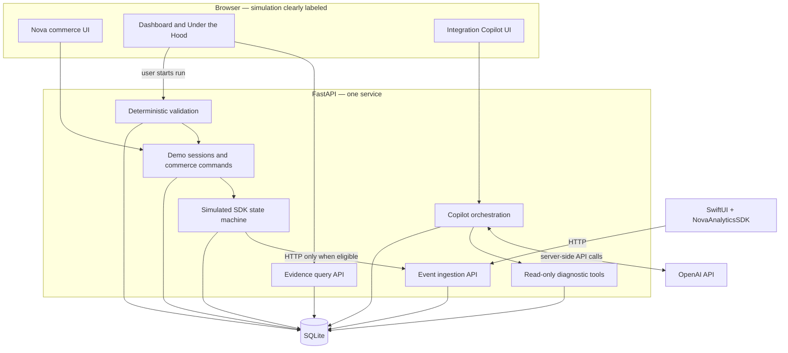

# SignalTrace architecture

Status: ingestion, session retrieval, and the first visible browser MVP are implemented. The broader diagnostic system described below remains a target architecture. Scope and user intent are defined in the [product brief](product-brief.md); delivery gates are in the [build plan](build-plan.md).

## Implemented increment: event ingestion

The ingestion path is HTTP client → FastAPI request validation → SQLite. `apps/api/models.py` defines the contract; `database.py` creates the table and commits inserts; `main.py` exposes `POST /events`. The visible MVP below adds retrieval and a browser simulation without changing this ingestion contract.

Each event contains required `event_id`, `event`, `session_id`, `timestamp`, and `product_id` fields. The supported event names are `product_viewed` and `product_added_to_cart`. IDs are case-sensitive strings of 1–128 non-whitespace characters. Timestamps require a timezone and are normalized to UTC. Extra fields are rejected. See the [README event contract](../README.md#event-contract) for the exact timestamp format and runnable examples.

SQLite enforces global uniqueness of `event_id`. Accepted inserts return `201` only after commit. All duplicate IDs return `409` without changing the original row, including identical replays and submissions with another session. Invalid or unsupported events return `422`; operational storage failures return `503`. This supersedes the earlier proposed `/v1/events` route, session-scoped duplicate key, and `200` duplicate response.

Each insertion uses a short-lived connection, a parameterized statement, and a transaction. Database setup runs at application startup. `SIGNALTRACE_DB_PATH` selects the file, defaulting to `data/signaltrace.sqlite3` relative to the working directory. Tests use isolated files and independently read stored rows; the database and transport behavior are not mocked.

Authentication, session ownership, richer event metadata, migrations, and deployment are deferred. `session_id` is currently metadata supplied by the caller, not an authorization boundary. Run the API locally until those controls are implemented.

## Implemented increment: visible browser MVP

`apps/web` uses Next.js/React. Nova's cart, analytics initialization, expected events, and HTTP attempt evidence are browser-owned simulations. A healthy product view or cart action posts the unchanged five-field payload through Next.js's same-origin proxy to the real FastAPI `POST /events`. Missing initialization records an expectation but sends no ingestion request. This browser-owned state is an explicit bounded exception to the future backend-owned simulation described below; see D13.

`GET /sessions/{session_id}/events` reads committed SQLite rows with a parameterized, case-sensitive session filter, ordered by insertion (`rowid`). It returns an array of contract events, including an empty array for an unknown session, and disables caching. Identifier rules match ingestion; operational read failures return `503`. This is filtering, not session authorization. No schema migration or write behavior change is required.

Nova Analytics reads after each action and polls three seconds after each background read completes. Health requires both behavior types and every expected event to match stored ID, session, name, product, and timestamp. HTTP acceptance alone cannot produce healthy status. Unavailable reads display unconfirmed delivery and label any prior activity stale. Request timeouts are eight seconds. New modes/reloads create independent UUID sessions; disposed sessions cannot update the active view, and older reads cannot overwrite newer evidence.

Only accepted events are durable. Browser expectations, cart state, and attempt evidence disappear on reload; no session recovery or replay is claimed. There is no ingestion retry, checkout, AI diagnosis, remediation command, or native SDK. The API remains local and unauthenticated; unbounded reads are a small-demo shortcut pending pagination, retention, and ownership controls. The following sections preserve the deeper target design for later increments.

## System boundaries

SignalTrace will use one repository, one web application, one FastAPI service, and one SQLite database initially. Ingestion, simulation, diagnostics, and validation are modules in the same backend, not separate deployed services.

The browser will render Nova's commerce simulation, a debugging dashboard, the Integration Copilot, and “Under the Hood.” FastAPI will own simulated SDK state so the UI, tools, and validator read the same authoritative evidence. A browser click becomes a commerce command sent to that backend; it is not itself an analytics ingestion request.

After initialization, the simulated SDK will send an actual HTTP request to the ingestion endpoint using an asynchronous HTTP client and a deployment-configured internal base URL. The endpoint will authenticate, validate, and persist the event. This loopback HTTP boundary deliberately makes transport outcomes inspectable without requiring another service. Commit tracking-attempt records before the request and never hold a database transaction open while awaiting HTTP. The native SDK will call the same ingestion contract from the device.

Before initialization, the simulated SDK will record a dropped attempt and make no ingestion request. Test doubles may replace transport in unit tests, but the runnable demo and HTTP integration tests must exercise actual HTTP ingestion.



All OpenAI API calls will run in FastAPI. `OPENAI_API_KEY` will be loaded only from server-side configuration or a secret store. It must never appear in browser bundles, public environment variables, the Swift app, logs, tool results, or committed files. This follows the [OpenAI authentication guidance](https://developers.openai.com/api/reference/overview#authentication).

## Technology choices

| Area | Proposed choice | Reason and cost |
| --- | --- | --- |
| Web | Next.js, React, TypeScript | One interface for the simulation, evidence, and technical explanation; keep domain state in FastAPI to avoid two backends owning it |
| Backend | Python, FastAPI, Pydantic | Typed request validation and OpenAPI contracts alongside Python diagnostic and evaluation logic |
| Persistence | SQLite on persistent local storage | Simple setup and inspectable data for a small, single-instance demo; migrate before multi-instance or write-heavy operation |
| Native reference | SwiftUI and Swift Package Manager | A real iOS app lifecycle and an independently testable `NovaAnalyticsSDK` package |
| AI | OpenAI Responses API through the Python SDK | Explicit function calls with application-owned execution; select and record a model during evaluation |
| Verification | pytest, web unit tests, Playwright, Swift tests | Separate backend behavior, UI logic, browser flow, and native behavior |
| CI | GitHub Actions | Reviewable checks and artifacts associated with commits and PRs; native checks require an appropriate macOS runner |

These choices follow the requested architecture preferences. Relevant platform capabilities are documented in [Next.js](https://nextjs.org/docs), [FastAPI features](https://fastapi.tiangolo.com/features/), and [SQLite deployment guidance](https://www.sqlite.org/whentouse.html). The implemented API targets Python 3.12+, with pinned runtime and test dependencies in `requirements.txt` and `requirements-dev.txt`. Web, native, and AI dependencies remain unselected.

## SDK and commerce behavior

The initial SDK contract will include initialization, event tracking, and a diagnostic state snapshot. Initialization will be explicit and idempotent for the same configuration. Tracking before initialization will return a typed `SDK_NOT_INITIALIZED` outcome and write a diagnostic record. It will not throw an unhandled error into the commerce action, buffer the event, or send it later automatically.

Once initialized, a valid tracking call will create an event and attempt ingestion. Collection also requires consent; the first scenario starts with fictional consent granted. A future consent incident must explain intentional suppression and must not recommend overriding a user's choice.

The first version will send individual events without background batching or automatic retries. A retry policy is deferred until a delivery incident requires it. Event identifiers will support duplicate detection even before automatic retries exist.

The commerce command handler will separately record that an action should produce an event. That expectation must not be derived solely from SDK output: otherwise a missing tracking call would be invisible. `view_product` expects `product_viewed`; `add_to_cart` expects `product_added_to_cart`.

## Identity, state, and persistence

All records will carry an opaque `session_id`; activity will additionally use `run_id`, `action_id`, `attempt_id`, and `event_id` as applicable. A request actually sent over HTTP will receive a correlated `request_id`. Timestamps use UTC; ordering and freshness also use a monotonic session `state_version` so timestamp equality does not imply identical state.

| Record | Purpose / minimum information |
| --- | --- |
| Session and SDK state | Session capability, evidence source, initialization state, consent state, configuration fingerprint, state version, expiration |
| Run | Baseline or validation, start/end time, SDK version at start, run-scoped commerce state |
| Commerce action | Action ID, product ID, expected event name, run ID, timestamp |
| Tracking attempt | Action correlation, SDK state at call time, outcome, reason, optional event ID |
| Delivery attempt | Attempt correlation, request ID, start/end time, transport outcome, nullable HTTP status, sanitized response |
| Ingested event | Validated event envelope, server receipt time, originating request, unique session/event identity |
| Runtime log | Log ID, layer, stable code, severity, timestamp, state version, correlation IDs, redacted message |
| Remediation | Explicit user action, previous/new state version, outcome, timestamp |
| Agent turn and tool trace | Model and prompt version, tool name, sanitized arguments/result, call ID, evidence references, timing, provider usage |
| Validation result | Run ID, expected/observed evidence, named checks, status, timestamps, failure reasons |

Failed attempts and later successes remain separate records. A validation must not erase the baseline failure. Starting over creates a new isolated session; cleanup may remove expired demo sessions according to the documented retention setting. The exact retention period is a deployment decision still open.

The implemented event table uses a globally unique `event_id`; all duplicate submissions are rejected with `409`, and the original row remains unchanged. Future read endpoints must enforce session scope even if a caller guesses another run or event ID; no read endpoint or session authorization exists yet.

## Proposed API contract

Only `POST /events` below is implemented. The other endpoints remain planned. Paths are relative to FastAPI; a future web deployment should expose the service through a same-origin `/api` proxy. A session cookie/capability will bind browser requests to the server-assigned session; session IDs in URLs or model arguments are not authorization. Cookie-authenticated mutations must validate the request origin and use CSRF protection as appropriate.

| Method and path | Purpose | First-slice outcome |
| --- | --- | --- |
| `POST /demo/sessions` | Create isolated demo session and baseline run | `201` with identifiers and session binding |
| `POST /demo/actions` | Execute `view_product` or `add_to_cart` for the active run | `200` with commerce result, expectation, and tracking outcome, including a possible local drop |
| `GET /demo/state` | Read current SDK state and evidence metadata | `200`; absent evidence remains unknown |
| `GET /demo/logs` | Read a bounded log page for an owned run | `200` with cursor and provenance |
| `GET /demo/runs/{run_id}/events` | Compare expectations, attempts, and persisted events | `200` with distinct counts and record references |
| `POST /demo/fixes/initialize-sdk` | Apply the explicit demo initialization action | `200` with previous/new state versions; repeated identical initialization makes no additional change |
| `POST /demo/validations` | Execute a bounded replay through the commerce and SDK path | `200` with a completed result; a failed check is a result, not an HTTP success claim about ingestion |
| `GET /demo/validations/{run_id}` | Read the recorded validation result | `200`, or `404` if unavailable to this session |
| `POST /copilot/turns` | Ask the server-side Integration Copilot | `200` with answer and trace; a provider failure is surfaced separately |
| `POST /events` | Receive one analytics event; implemented now | `201` after persistence; `409` for any duplicate event ID |

Ingestion authentication is deferred. The planned credential will be limited and session-scoped, separate from the browser's control capability and from the OpenAI key. For the backend simulation it will stay on the server; the native reference will receive only the limited credential necessary to send its own demo events. It must not permit diagnostic reads, fixes, or access to another session. Body identifiers must match credential scope once that boundary exists.

The control API will reject unauthenticated or expired session access, invalid input, and concurrent mutations with explicit errors. Once a validation starts, conflicting commerce or configuration mutations return `409` until it completes. The bounded first-slice run is synchronous; a future longer workflow can introduce jobs without changing the meaning of validation results.

### Event envelope and HTTP outcomes

The implemented schema contains `event_id`, `event`, `session_id`, `timestamp`, and `product_id`. Both supported product events require the product identifier. `schema_version`, `run_id`, `action_id`, `source`, richer properties, and cart quantity remain possible future additions, requiring an explicit contract revision and tests. Current requests containing those undeclared fields are rejected. A future `source` field may distinguish browser simulation from native execution; it will not be an authorization mechanism.

| Observation | Meaning | Storage and display |
| --- | --- | --- |
| No request; `SDK_NOT_INITIALIZED` | Tracking stopped inside the SDK model | Dropped attempt, `http_status=null`, no delivery-request row |
| `201` | New valid event persisted | Receipt and stored event are available |
| `401` | Ingestion credential missing or invalid | Authentication rejection; never describe it as missing initialization |
| `409` | Event ID already exists, regardless of content or session | Conflict; original event remains unchanged |
| `422` | Event envelope fails schema validation | Structured validation errors; no event persisted |
| `503` | Ingestion service cannot complete the request | Server failure; no success inferred |
| Timeout / connection failure | No HTTP response was observed | `http_status=null`; receipt state may be unknown until queried |

The ingestion endpoint currently implements `201`, `409`, `422`, and `503` for SQLite operational failures. Authentication (`401`), SDK outcomes, transport diagnostics, and incident controls remain planned. A future successful `/demo/actions` response will only confirm command processing; its status must never be reused as the analytics delivery status.

No receipts will be fabricated when transport fails. A lost response may coexist with a stored event; the dashboard will preserve both facts, and the validator will report an incomplete delivery check until the discrepancy is resolved.

## Integration Copilot and tool boundary

The backend will define JSON-schema function tools, validate requested arguments, execute allowlisted handlers, and return results to the model using the corresponding call IDs. The model requests tools; application code executes them. This follows the [OpenAI function-calling flow](https://developers.openai.com/api/docs/guides/function-calling).

Use strict tool schemas with `additionalProperties=false` and all declared properties required; represent an optional value as nullable when needed. See [OpenAI strict-mode requirements](https://developers.openai.com/api/docs/guides/function-calling#strict-mode). Runtime authorization and validation remain application responsibilities.

| Proposed function | Model-visible arguments | Result |
| --- | --- | --- |
| `get_sdk_state` | None | Current initialization and consent state; configuration presence without secrets; source, observation time, state version, recent attempt references |
| `get_runtime_logs` | `run_id`, `limit` bounded to 1–100 | Scoped, redacted log records; truncation indicator; observation metadata |
| `get_event_delivery` | `run_id` | Independent expectations, tracking and transport outcomes, receipts, stored events, correlation IDs |
| `get_validation_result` | `run_id` | Recorded checks, status, and evidence references; does not start a run |

The server binds the session and supplies the active run reference in conversation context. The model cannot choose another session. All run references are authorized before access. Tools return typed errors such as `EVIDENCE_UNAVAILABLE` or `RUN_NOT_FOUND`, never empty success-shaped objects that imply a healthy system.

Illustrative `get_sdk_state` result shape — fictional example, not captured output:

```json
{
  "observation_id": "obs_demo_001",
  "source": "simulated_backend",
  "observed_at": "2026-09-28T00:00:00Z",
  "state_version": 1,
  "initialized": false,
  "initialization_observed_at": null,
  "consent": "granted",
  "recent_attempt_ids": ["attempt_demo_001", "attempt_demo_002"],
  "dropped_before_initialization": 2,
  "last_error_code": "SDK_NOT_INITIALIZED"
}
```

The first incident requires `get_sdk_state` before a definitive diagnosis. Configure that first diagnostic turn to request the tool, then evaluate how the agent interprets its result; do not claim that a forced call measures autonomous tool selection. Subsequent evidence requests may use the remaining read-only tools.

The answer should name the failing layer, explain the observed facts, cite their identifiers, recommend initialization before tracking, and describe the validation needed. It must not claim downstream authentication or delivery has been tested merely because initialization is missing.

The UI will show tool names, sanitized inputs/results, timing, and evidence references, followed by a concise explanation. It will not display private model reasoning. No tool can initialize the SDK, change consent, run arbitrary code, browse arbitrary URLs, or start validation. User controls own those mutations.

Scenario identifiers, injected-fault switches, reference answers, and grader labels will be withheld from model context and diagnostic projections. Runtime evidence such as `SDK_NOT_INITIALIZED` is valid evidence and remains visible. Treat user text and logs as untrusted data, not instructions to change tool permissions. Recheck state versions before attaching a diagnosis to the current UI state; show older evidence as historical if the session changed.

Set explicit per-turn limits on model calls, tool calls, time, and token use before enabling live AI. When a limit, tool failure, or provider error is reached, report an incomplete diagnosis with available evidence. Without provider credentials, the Copilot is unavailable; manual diagnostics and validation remain usable. Any optional mocked mode must be selected explicitly and labeled, including in exported traces.

## Remediation and validation

Applying the demo fix records the user's action and initializes the current simulated SDK. It does not mark the incident resolved. Validation creates a fresh run with separate commerce state, action IDs, and event IDs, then invokes the same commerce command handler and SDK transport path used by the user flow. It must never insert successful events directly into storage.

| Required validation check | Evidence for a pass |
| --- | --- |
| SDK readiness | Initialized state observed for the run; no configuration change during execution |
| Action expectations | Exactly one view and one add-to-cart action, each with its expected event |
| Tracking | Two eligible tracking attempts, correctly correlated; no local drop |
| Delivery | Two fresh ingestion requests with successful persisted-event acknowledgments |
| Persistence | Exactly the two expected event IDs, names, and properties stored for this run and session |
| Isolation | No older, duplicate, or other-session events counted as recovery |

Possible validation states are `running`, `passed`, `failed`, and `inconclusive`. Missing or interrupted evidence yields `inconclusive`, never `passed`. A pre-fix validation must fail with initialization and delivery evidence. A post-fix pass must reference the fresh run's receipts and stored events. Old failure records remain available.

The dashboard will poll bounded evidence endpoints initially and display its observation time. Each mutation triggers a refresh. Polling is sufficient for this small event volume; streaming can be added if observed latency warrants it. “Live” means evidence from the current run, not a static animation.

## Native reference and parity

The planned SwiftUI app will support the same two commerce actions. The original `NovaAnalyticsSDK` Swift package will implement explicit initialization, typed pre-initialization failures, consent gating, event encoding, HTTP transport, and local diagnostic state. It will not depend on an existing vendor SDK.

The browser and native paths share schema fixtures and observable behavior, not executable SDK code. Native unit tests will verify no network call before initialization, correct post-initialization payloads, and error handling. A device/simulator integration run will verify ingestion against FastAPI.

Native SDK state initially remains local to the reference app. The browser Copilot's `get_sdk_state` inspects the backend simulation; it does not inspect a real device. Native diagnostic upload or pairing for the Copilot is a future extension requiring explicit consent, source labeling, freshness, and session binding. Native events may be inspected in the dashboard only within a deliberately paired demo session.

## Deployment assumptions and open decisions

The initial deployment assumes one FastAPI instance with persistent local SQLite storage and a same-origin web/API entry point. It does not assume a stateless hosting filesystem or multiple database writers across machines. OpenAI traffic and the SDK model's ingestion URL are server-configured, not user-controlled destinations.

Before public hosting, select the host and persistent-volume arrangement, session expiration and cleanup, request and provider-spend limits, and an operational logging policy. Keep all data fictional, redact credentials, and expose only sanitized diagnostic fields to the model. Domain setup, hosting, and live provider spending are outside the current ingestion increment.

The model/version, web/native package versions, minimum iOS target, exact cost/time limits, and additional incident order remain open. The ingestion dependencies are pinned. Revisit triggers and alternatives are recorded in [product decisions](product-decisions.md).
